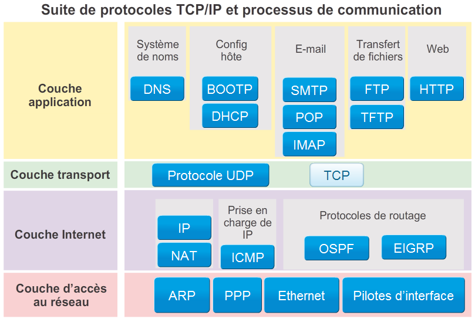
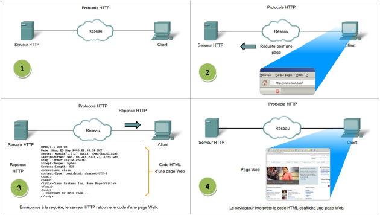

# Les certificats et leur utilité sur le Web (http/https)

## Les Protocoles

Pour que 2 personnes se comprennent, il faut qu’elle parle la même langue. Et bien en informatique, c’est pareil : il faut que le navigateur sache dans quelle langue il doit parler au serveur. Cette langue est appelée protocole.

Il existe différents protocoles sur différents niveaux.



[Article détaillé](https://linux-note.com/principaux-protocoles-et-leur-fonction/ "lien vers article")

## Explications du protocole HTTP

Ce protocole est un protocole de communication client-serveur et fonctionne sur le principe "requête-réponse". Dans le [modèle OSI](http://edutechwiki.unige.ch/fr/Mod%C3%A8le_OSI), le protocole HTTP est un protocole de la couche application.

L'acronyme HTTP signifie "Hypertext Transfert Protocol". Il a été inventé par [Tim-Berner](https://fr.wikipedia.org/wiki/Tim_Berners-Lee "Fiche Wikipedia de Tim Bernes-Lee") Lee dans les années 1990. C'est le protocole le plus utilisé sur Internet. La version 1.0 du protocole (la plus utilisée) permet désormais de transférer des messages avec des en-têtes décrivant le contenu du message en utilisant un codage de type [MIME](https://fr.wikipedia.org/wiki/Multipurpose_Internet_Mail_Extensions).

Le but du protocole HTTP est de permettre un transfert de fichiers (essentiellement au format HTML) localisés grâce à une chaîne de caractères appelée URL (Uniform Resource Locator) entre un navigateur (le client) et un serveur Web.

Une adresse Internet est toujours constituée de la façon suivante :
```html
<protocole>://<adresse-du-serveur>:<port>/<chemin>/<ressource>
```

### Schéma d'une communication sur le protocole HTTP



## Le risque du Protocole HTTP

Quand vous vous authentifiez, vous envoyez votre identifiant et votre mot de passe à un serveur, qui va tâcher de vous reconnaître, et vous indiquera si vous avez bien été connecté à votre compte.

Le problème étant que pour ça, vous devez l’envoyer. C’est à ce moment-là que vos infos sont les plus vulnérables car il existe une attaque, appelée “[Man in the Middle](https://fr.wikipedia.org/wiki/Attaque_de_l%27homme_du_milieu)”, littéralement “Homme au milieu” qui consiste à écouter et intercepter des flux de données, et à les relayer au serveur comme si de rien n’était.

## Explications du protocole HTTPS

## les certificats

## Ressources

- Documentations :

  - Pile des Protocoles :

    <https://linux-note.com/principaux-protocoles-et-leur-fonction/>

  - Le protocole HTTP :

    <https://edutechwiki.unige.ch/fr/Le_fonctionnement_du_protocole_HTTP>
    <http://silanus.fr/sin/formationSTI2D/ModuleReseau/co/Reseau_58.html>

  - les Certificats :

    <https://www.webexmachina.fr/article/2018/04/le-petit-guide-du-protocole-https-certificat-ssl.html>

    <https://fr.wikipedia.org/wiki/Certificat_%C3%A9lectronique>

- Format de la page de présentation :

    <https://github.com/simplonco/corp-bnp-renault/blob/master/session1/presentation/reussir-la-formation.html>
